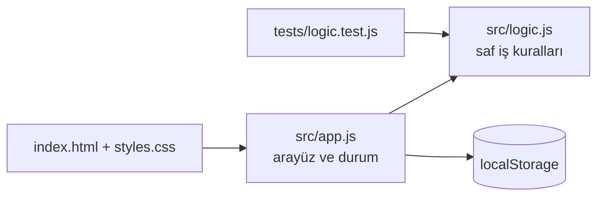

# Pomodoro Odak

[](https://github.com/ahmetbolukoglu/pomodoro-odak/actions/workflows/appnar.yml)
[](https://ahmetbolukoglu.github.io/pomodoro-odak/)


> 25 dakikalık çalışma ve 5 dakikalık mola döngülerini sayan, günlük odak istatistiği tutan sayaç uygulaması

**Canlı demo:** https://ahmetbolukoglu.github.io/pomodoro-odak/

Pomodoro Odak, odaklanma ve verimlilik alışkanlıklarını geliştirmek için tasarlanmış bir productivity uygulamasıdır. 25 dakikalık çalışma ve 5 dakikalık mola döngüleriyle çalışmayı destekler; ayrıca görev bazlı oturum kaydı, günlük ve haftalık istatistikler, sesli bildirimler ve seri takibi özellikleri sunar. Özellikle çalışkan ve odaklı bir şekilde zaman yönetimi yapmak isteyen bireyler, öğrenciler ve profesyoneller için idealdir.

## Özellikler
- 🍅 25/5 dakikalık standart Pomodoro döngüleri ve özel süre ayarları
- 📋 Görev bazlı oturum kaydı ve takibi
- 📊 Günlük ve haftalık odak istatistikleri
- 🔊 Sesli bildirimler ve uyarılar
- 🔥 Seri (streak) takibi ve başarı göstergeleri
- 🌙 Karanlık ve açık tema desteği
- 💾 Veri kalıcılığı ve offline çalışabilme

## Nasıl çalışır



## Yerelde çalıştır

```bash
git clone https://github.com/ahmetbolukoglu/pomodoro-odak.git
cd pomodoro-odak
npx serve .        # veya herhangi bir statik sunucu
npm test
```

Bağımlılık yok: düz HTML, CSS ve JavaScript modülleri.

## Proje yapısı

```
index.html          sayfa iskeleti
styles.css          tasarım, açık/koyu tema
src/app.js          arayüz ve kalıcı durum
src/logic.js        saf fonksiyonlar (test edilir)
tests/              node:test birim testleri
docs/PLAN.md        ürün planı
```

## Lisans

MIT © 2026 ahmetbolukoglu

---
<sub>Bu repo [AppNar](https://github.com/topics/appnar) ile üretildi.</sub>
